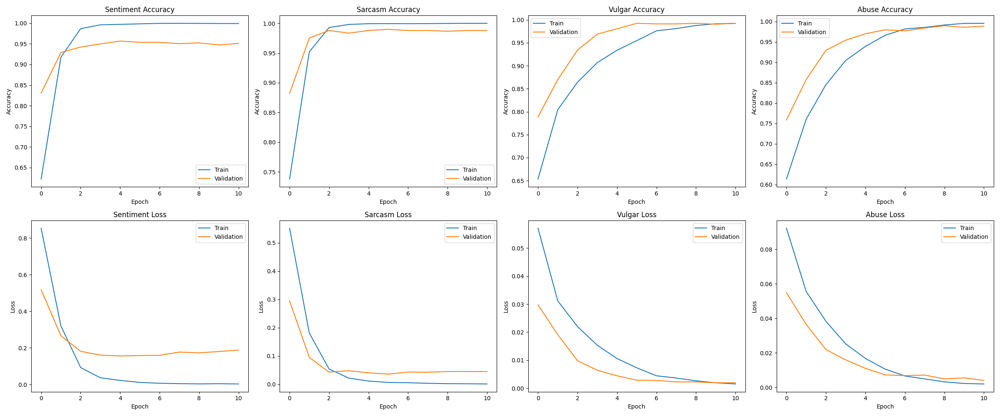
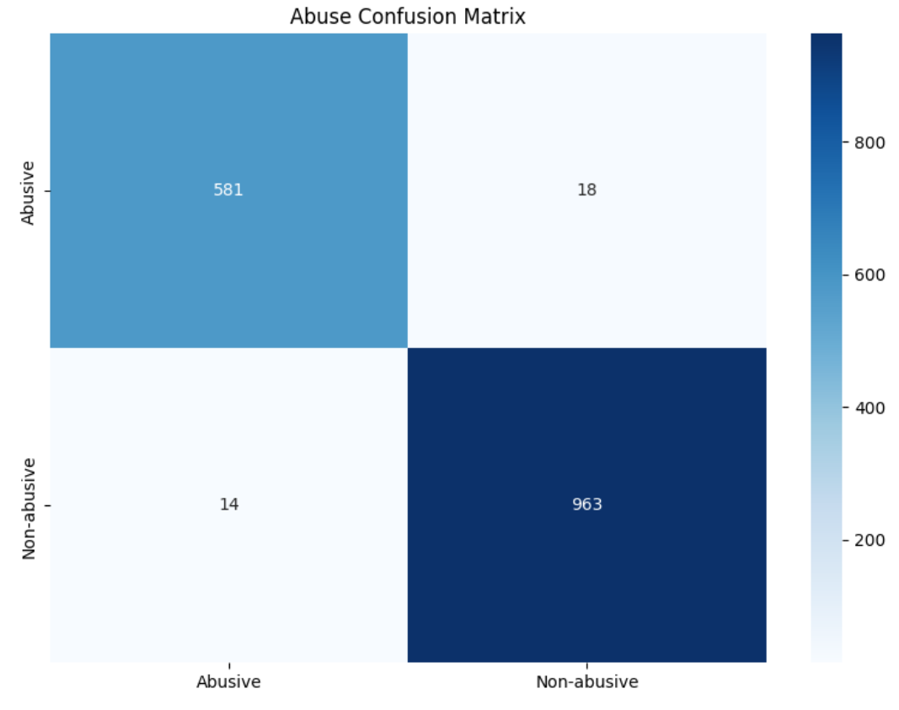
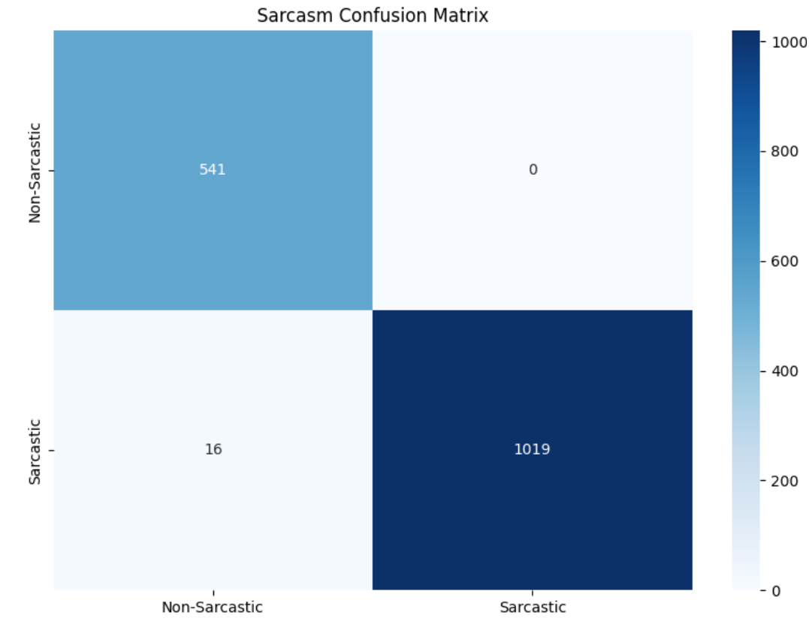
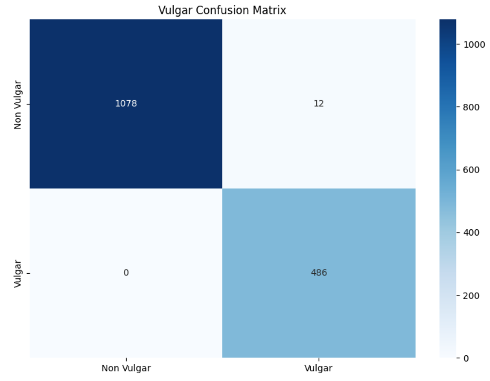

  
  <h1 align="center">  
      
     Hate Speech and Offensive Content Detection in Bangla Memes Using Multimodal Deep Learning and Transformer
  </h1>  

  <h3>Developed with the packages and tools below 🛠️</h3>  

  

    
    
    
    
    
    
    
    
    
    
    
    
    
    
    
    
    
    
  

  
  
  
  

### Dataset Overview

The training set consists of 2,693 samples and seven features (Ids, Sentiment, Sarcasm, Vulgar, Abuse, Target, OCR). A total of 575 samples (21.35%) contain missing Target annotations. The OCR-extracted text field includes 2,523 unique entries, with word counts ranging from 0 to 518 words (mean: 16.1 words per entry). The most frequently occurring words are “না” (426 occurrences), “আমি” (295), “করে” (289), “যখন” (217), and “আমার” (210). Sentiment distribution is skewed toward the negative class (1,476 samples, 54.81%), followed by positive (906, 33.64%) and neutral (311, 11.55%). Sarcasm is prevalent, with 2,081 sarcastic samples (77.27%) compared to 612 non-sarcastic samples (22.73%). The dataset is predominantly non-vulgar (2,226 samples, 82.66%) and non-abusive (1,954 samples, 72.56%), with vulgar (467, 17.34%) and abusive (739, 27.44%) samples forming smaller proportions.

The test set comprises 1,821 samples, containing 1,688 unique OCR texts and no missing or empty OCR values. Each sample is paired with an image, with 54.5% stored in .jpg format (993 files) and 45.5% in .png format (828 files). The test set contains no missing or corrupt image files, ensuring completeness and integrity for model evaluation.

**_**Table 1.** Column summary of the Bangla training dataset._**

| Column    | Dtype  | Null Count | Null % | Unique Count | Unique Values               |
| --------- | ------ | ---------- | ------ | ------------ | --------------------------- |
| Ids       | object | 0          | 0.00   | 2,693        | 2,693 unique values         |
| Sentiment | object | 0          | 0.00   | 3            | Neutral, Negative, Positive |
| Sarcasm   | object | 0          | 0.00   | 2            | Sarcastic, Non-Sarcastic    |
| Vulgar    | object | 0          | 0.00   | 2            | Non Vulgar, Vulgar          |
| Abuse     | object | 0          | 0.00   | 2            | Abusive, Non-abusive        |
| Target    | object | 575        | 21.35  | 32           | 32 unique values            |
| OCR       | object | 1          | 0.04   | 2,523        | 2,523 unique values         |

_****Table 2.** Sentiment label distribution in the training dataset**._

| Value    | Count | Percentage |
| -------- | ----- | ---------- |
| Negative | 1,476 | 54.81%     |
| Positive | 906   | 33.64%     |
| Neutral  | 311   | 11.55%     |

_**Table 3. Sarcasm label distribution in the training dataset.**_

| Value         | Count | Percentage |
| ------------- | ----- | ---------- |
| Sarcastic     | 2,081 | 77.27%     |
| Non-Sarcastic | 612   | 22.73%     |

**_**Table 4.** Vulgarity label distribution in the training dataset._**

| Value      | Count | Percentage |
| ---------- | ----- | ---------- |
| Non Vulgar | 2,226 | 82.66%     |
| Vulgar     | 467   | 17.34%     |

**_Table 5. Abuse label distribution in the training dataset._**

| Value       | Count | Percentage |
| ----------- | ----- | ---------- |
| Non-abusive | 1,954 | 72.56%     |
| Abusive     | 739   | 27.44%     |

**_Table 6. OCR text statistics in the training dataset._**

| Metric             | Value                                                 |
| ------------------ | ----------------------------------------------------- |
| Average word count | 16.1                                                  |
| Min word count     | 0                                                     |
| Max word count     | 518                                                   |
| Most common words  | না (426), আমি (295), করে (289), যখন (217), আমার (210) |

**_Table 7. Basic statistics of the Bangla test dataset._**

| Metric             | Value |
| ------------------ | ----- |
| Total samples      | 1,821 |
| Unique OCR texts   | 1,688 |
| Missing OCR (null) | 0     |
| Empty OCR strings  | 0     |

**_Table 8. Image file statistics in the test dataset._**

| Metric         | Count | Percentage |
| -------------- | ----- | ---------- |
| `.jpg` files   | 993   | 54.5%      |
| `.png` files   | 828   | 45.5%      |
| Missing images | 0     | 0.0%       |
| Corrupt images | 0     | 0.0%       |

### Results

Resnet50 and BUET_CSE_BanglaBERT

 

<b>Figure 1:</b> Confusion matrices for sentiment, abuse, sarcasm, and vulgarity classification tasks.

 
 

<table>
  <tr>
    <td align="center">
       
      (a) Sentiment confusion matrix
    </td>
    <td align="center">
       
      (b) Abuse confusion matrix
    </td>
  </tr>
  <tr>
    <td align="center">
       
      (c) Sarcasm confusion matrix
    </td>
    <td align="center">
       
      (d) Vulgarity confusion matrix
    </td>
  </tr>
</table>

<b>Figure 1:</b> Confusion matrices for sentiment, abuse, sarcasm, and vulgarity classification tasks.

Table 9. Classification report for sentiment prediction.

| Class        | Precision | Recall | F1-score | Support |
| ------------ | --------- | ------ | -------- | ------- |
| Negative     | 0.978     | 0.932  | 0.954    | 798     |
| Neutral      | 0.965     | 1.000  | 0.982    | 307     |
| Positive     | 0.909     | 0.960  | 0.934    | 471     |
| accuracy     | 0.954     | 0.954  | 0.954    | 0.954   |
|              |           |        |          |         |
| macro avg    | 0.951     | 0.964  | 0.957    | 1576    |
| weighted avg | 0.955     | 0.954  | 0.954    | 1576    |

Table 10. Classification report for abuse detection.
| Class        | Precision | Recall | F1-score | Support |
| ------------ | --------- | ------ | -------- | ------- |
| Abusive      | 0.976     | 0.970  | 0.973    | 599     |
| Non-abusive  | 0.982     | 0.986  | 0.984    | 977     |
| accuracy     | 0.980     | 0.980  | 0.980    | 0.980   |
|              |           |        |          |         |
| macro avg    | 0.979     | 0.978  | 0.978    | 1576    |
| weighted avg | 0.980     | 0.980  | 0.980    | 1576    |

Table 11. Classification report for sarcasm detection.
| Class         | Precision | Recall | F1-score | Support |
| ------------- | --------- | ------ | -------- | ------- |
| Non-Sarcastic | 0.971     | 1.000  | 0.985    | 541     |
| Sarcastic     | 1.000     | 0.985  | 0.992    | 1035    |
| accuracy      | 0.990     | 0.990  | 0.990    | 0.990   |
|               |           |        |          |         |
| macro avg     | 0.986     | 0.992  | 0.989    | 1576    |
| weighted avg  | 0.990     | 0.990  | 0.990    | 1576    |

Table 12. Classification report for vulgarity detection.
| Class        | Precision | Recall | F1-score | Support |
| ------------ | --------- | ------ | -------- | ------- |
| Non Vulgar   | 1.000     | 0.989  | 0.994    | 1090    |
| Vulgar       | 0.976     | 1.000  | 0.988    | 486     |
| accuracy     | 0.992     | 0.992  | 0.992    | 0.992   |
|              |           |        |          |         |
| macro avg    | 0.988     | 0.994  | 0.991    | 1576    |
| weighted avg | 0.993     | 0.992  | 0.992    | 1576    |

### Conclusion

