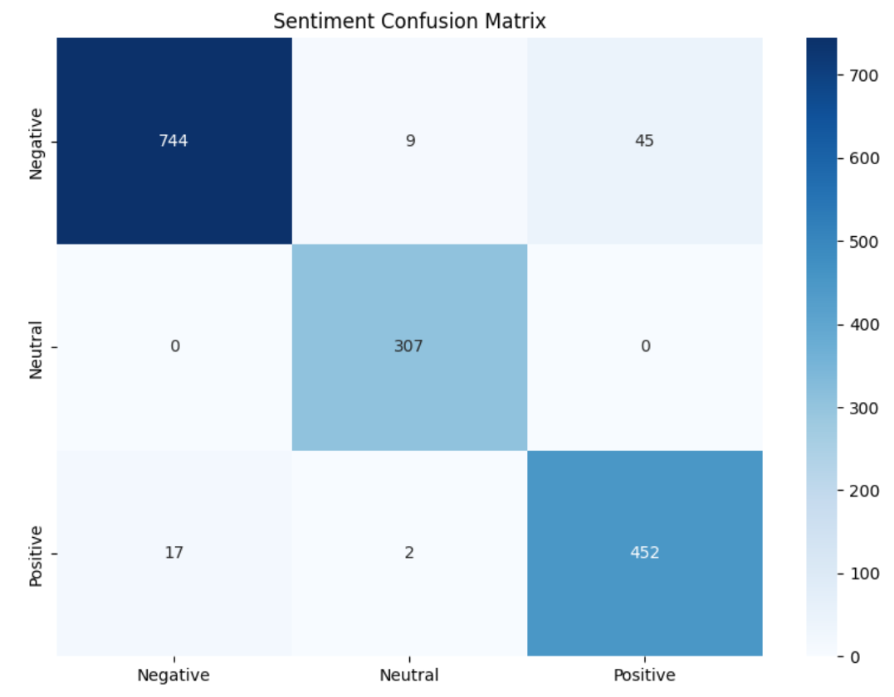

  
  <h1 align="center">  
      
     Hate Speech and Offensive Content Detection in Bangla Memes Using Multimodal Deep Learning and Transformer
  </h1>  

  <h3>Developed with the packages and tools below 🛠️</h3>  

  

    
    
    
    
    
    
    
    
    
    
    
    
    
    
    
    
    
    
  

  
  
  
  

## Abstract

This study presents a multimodal deep learning framework for detecting hate speech and offensive content in Bangla memes, as part of the HASOC (Hate Speech and Offensive Content) 2025 competition on Kaggle. The dataset comprises 2,693 training and 1,821 test samples, each annotated across four classification tasks: Sentiment, Sarcasm, Vulgarity, and Abuse. We propose a dual-branch architecture integrating a convolutional neural network (ResNet50 or ResNet152) for image feature extraction and a transformer-based language model (BUET\_CSE\_BanglaBERT, SagarSharkar BanglaBERT, or XLM-RoBERTa-base) for text encoding. The visual and textual embeddings are projected into a common latent space, concatenated, and passed through a multi-head classification module, enabling prediction of all four tasks. Experiment shows high accuracy across all categories, with the best-performing configuration (ResNet50 + BUET\_CSE\_BanglaBERT) achieving up to 0.990 accuracy in binary tasks and 0.954 accuracy in sentiment classification on the validation set. While binary classification tasks such as Sarcasm and Vulgarity achieve near-perfect performance, sentiment polarity remains the most challenging due to class overlap. The proposed model ranked 7th out of 17 teams (23 participants) on the competition leaderboard with a macro F1-score of 0.5763, compared to the top score of 0.6276, demonstrating competitive performance in a challenging multimodal classification setting.

## Dataset Overview

The training set consists of 2,693 samples and seven features (Ids, Sentiment, Sarcasm, Vulgar, Abuse, Target, OCR). A total of 575 samples (21.35%) contain missing Target annotations. The OCR-extracted text field includes 2,523 unique entries, with word counts ranging from 0 to 518 words (mean: 16.1 words per entry). The most frequently occurring words are “না” (426 occurrences), “আমি” (295), “করে” (289), “যখন” (217), and “আমার” (210). Sentiment distribution is skewed toward the negative class (1,476 samples, 54.81%), followed by positive (906, 33.64%) and neutral (311, 11.55%). Sarcasm is prevalent, with 2,081 sarcastic samples (77.27%) compared to 612 non-sarcastic samples (22.73%). The dataset is predominantly non-vulgar (2,226 samples, 82.66%) and non-abusive (1,954 samples, 72.56%), with vulgar (467, 17.34%) and abusive (739, 27.44%) samples forming smaller proportions.

The test set comprises 1,821 samples, containing 1,688 unique OCR texts and no missing or empty OCR values. Each sample is paired with an image, with 54.5% stored in .jpg format (993 files) and 45.5% in .png format (828 files). The test set contains no missing or corrupt image files, ensuring completeness and integrity for model evaluation.

**_**Table 1.** Column summary of the Bangla training dataset._**

| Column    | Dtype  | Null Count | Null % | Unique Count | Unique Values               |
| --------- | ------ | ---------- | ------ | ------------ | --------------------------- |
| Ids       | object | 0          | 0.00   | 2,693        | 2,693 unique values         |
| Sentiment | object | 0          | 0.00   | 3            | Neutral, Negative, Positive |
| Sarcasm   | object | 0          | 0.00   | 2            | Sarcastic, Non-Sarcastic    |
| Vulgar    | object | 0          | 0.00   | 2            | Non Vulgar, Vulgar          |
| Abuse     | object | 0          | 0.00   | 2            | Abusive, Non-abusive        |
| Target    | object | 575        | 21.35  | 32           | 32 unique values            |
| OCR       | object | 1          | 0.04   | 2,523        | 2,523 unique values         |

_****Table 2.** Sentiment label distribution in the training dataset**._

| Value    | Count | Percentage |
| -------- | ----- | ---------- |
| Negative | 1,476 | 54.81%     |
| Positive | 906   | 33.64%     |
| Neutral  | 311   | 11.55%     |

_**Table 3. Sarcasm label distribution in the training dataset.**_

| Value         | Count | Percentage |
| ------------- | ----- | ---------- |
| Sarcastic     | 2,081 | 77.27%     |
| Non-Sarcastic | 612   | 22.73%     |

**_**Table 4.** Vulgarity label distribution in the training dataset._**

| Value      | Count | Percentage |
| ---------- | ----- | ---------- |
| Non Vulgar | 2,226 | 82.66%     |
| Vulgar     | 467   | 17.34%     |

**_Table 5. Abuse label distribution in the training dataset._**

| Value       | Count | Percentage |
| ----------- | ----- | ---------- |
| Non-abusive | 1,954 | 72.56%     |
| Abusive     | 739   | 27.44%     |

**_Table 6. OCR text statistics in the training dataset._**

| Metric             | Value                                                 |
| ------------------ | ----------------------------------------------------- |
| Average word count | 16.1                                                  |
| Min word count     | 0                                                     |
| Max word count     | 518                                                   |
| Most common words  | না (426), আমি (295), করে (289), যখন (217), আমার (210) |

**_Table 7. Basic statistics of the Bangla test dataset._**

| Metric             | Value |
| ------------------ | ----- |
| Total samples      | 1,821 |
| Unique OCR texts   | 1,688 |
| Missing OCR (null) | 0     |
| Empty OCR strings  | 0     |

**_Table 8. Image file statistics in the test dataset._**

| Metric         | Count | Percentage |
| -------------- | ----- | ---------- |
| `.jpg` files   | 993   | 54.5%      |
| `.png` files   | 828   | 45.5%      |
| Missing images | 0     | 0.0%       |
| Corrupt images | 0     | 0.0%       |

## Results
I have done multiple experiments with different combination of text and image based models. Everything is presented in my report. Here I am providing the best results. For this experiment I used **Resnet50** for image branch and **buetcsebanglabert** for the text branch.

### Training History

The training history shown in *Figure 1*, demonstrates rapid convergence and consistently high performance across all four classification tasks: **Sentiment, Sarcasm, Vulgarity, and Abuse**.

**Accuracy**

The training and validation accuracies increased sharply within the first 2–3 epochs.

* **Sentiment:** Accuracy improved from \~0.63 (train) and \~0.83 (validation) at epoch 0 to **0.99 (train)** and **0.95 (validation)** by epoch 10.
* **Sarcasm, Vulgarity, and Abuse:** Exhibited similar trends, with final accuracies **exceeding 0.98** on both training and validation sets.
* **Observation:** Vulgarity and Abuse showed slightly higher validation accuracy than training accuracy in later epochs, suggesting **no overfitting** for these tasks.

**Loss**

The loss curves mirrored the accuracy trends:

* **Sentiment & Sarcasm:** Loss approached near-zero values for training and remained low for validation → **minimal generalization error**.
* **Vulgarity & Abuse:** Loss values were extremely low (close to 0.0), consistent with their very high accuracies.

**Interpretation**

These results indicate that **multimodal fusion** of **ResNet50 (visual features)** and **BUET\_CSE\_BanglaBERT (textual features)** effectively captures discriminative information in Bangla memes.

* The **close alignment** between training and validation curves suggests **strong generalization** on the validation set.
* The near-perfect performance across all categories may also imply:

  * A relatively simple dataset
  * Correlated label structures (one category serving as a cue for others).

 
 
 

<b>Figure 1:</b> Training history.

 
 

### Confusion Matrix Analysis

The confusion matrices for the experiment (ResNet50 + BUET\_CSE\_BanglaBERT) further confirm the high classification performance across all four categories.

 **Abuse**

* Correctly identified **581 abusive** and **963 non-abusive** memes.
* Misclassifications: **18 false negatives** and **14 false positives**.
* Result: Balanced performance with very low misclassification rates.

 **Sarcasm**

* **Perfect precision** for the non-sarcastic class (**541/541 correct**).
* **High recall** for the sarcastic class (**1019 correct, 16 false negatives**).
* Observation: Sarcastic content is slightly harder to recall, though the error rate remains minimal.

 **Sentiment**

* **Negative class:** 744/798 correct predictions
* **Neutral class:** 307/307 correct (*perfect classification*)
* **Positive class:** 452/471 correct
* **Observation:** Most errors occurred between **Negative** and **Positive**, suggesting occasional polarity confusion.

 **Vulgarity**

* **Vulgar class:** 486/486 correctly classified (*perfect recall*)
* **Non-vulgar class:** 1078/1090 correct (12 false positives)
* **Observation:** Perfect recall for the vulgar class is especially noteworthy for offensive content detection.

<table>
  <tr>
    <td align="center">
       
      (a) Sentiment confusion matrix
    </td>
    <td align="center">
       
      (b) Abuse confusion matrix
    </td>
  </tr>
  <tr>
    <td align="center">
       
      (c) Sarcasm confusion matrix
    </td>
    <td align="center">
       
      (d) Vulgarity confusion matrix
    </td>
  </tr>
</table>

<b>Figure 1:</b> Confusion matrices for sentiment, abuse, sarcasm, and vulgarity classification tasks.

 **Interpretation**

The confusion matrices confirm the **high precision and recall** observed in the training curves.

* **Overall:** Near-perfect performance.
* **Sentiment:** Slightly higher misclassification rates than binary tasks → reflects added complexity of multi-class classification.

### Classification Metrics

Table 9 to 12 presents the classification metrics for the four tasks:

* **Abuse:** 0.980 accuracy
* **Sarcasm:** 0.990 accuracy
* **Sentiment:** 0.954 accuracy
* **Vulgarity:** 0.992 accuracy

Additional observations:

* **Abuse:** 581 abusive and 963 non-abusive memes correctly classified (18 FN, 14 FP).
* **Sarcasm:** Perfect classification of non-sarcastic instances; **0.985 recall** for sarcastic memes.
* **Sentiment:** Perfect classification of Neutral class; recall of **0.932 (Negative)** and **0.960 (Positive)**.
* **Vulgarity:** Perfect recall for vulgar class; only 12 misclassifications for non-vulgar.

 **Final Interpretation**

* The **ResNet50 + BUET\_CSE\_BanglaBERT fusion** is highly effective for **Bangla meme classification**.
* Consistently high metrics + minimal misclassifications suggest the model effectively captures both **visual** and **linguistic cues**, generalizing well to validation.
* The **Sentiment task** showed slightly lower performance than binary tasks, reflecting the added **complexity of multi-class classification** where inter-class confusion (e.g., Negative vs Positive) is more likely.

Table 9. Classification report for sentiment prediction.

| Class        | Precision | Recall | F1-score | Support |
| ------------ | --------- | ------ | -------- | ------- |
| Negative     | 0.978     | 0.932  | 0.954    | 798     |
| Neutral      | 0.965     | 1.000  | 0.982    | 307     |
| Positive     | 0.909     | 0.960  | 0.934    | 471     |
| accuracy     | 0.954     | 0.954  | 0.954    | 0.954   |
|              |           |        |          |         |
| macro avg    | 0.951     | 0.964  | 0.957    | 1576    |
| weighted avg | 0.955     | 0.954  | 0.954    | 1576    |

Table 10. Classification report for abuse detection.
| Class        | Precision | Recall | F1-score | Support |
| ------------ | --------- | ------ | -------- | ------- |
| Abusive      | 0.976     | 0.970  | 0.973    | 599     |
| Non-abusive  | 0.982     | 0.986  | 0.984    | 977     |
| accuracy     | 0.980     | 0.980  | 0.980    | 0.980   |
|              |           |        |          |         |
| macro avg    | 0.979     | 0.978  | 0.978    | 1576    |
| weighted avg | 0.980     | 0.980  | 0.980    | 1576    |

Table 11. Classification report for sarcasm detection.
| Class         | Precision | Recall | F1-score | Support |
| ------------- | --------- | ------ | -------- | ------- |
| Non-Sarcastic | 0.971     | 1.000  | 0.985    | 541     |
| Sarcastic     | 1.000     | 0.985  | 0.992    | 1035    |
| accuracy      | 0.990     | 0.990  | 0.990    | 0.990   |
|               |           |        |          |         |
| macro avg     | 0.986     | 0.992  | 0.989    | 1576    |
| weighted avg  | 0.990     | 0.990  | 0.990    | 1576    |

Table 12. Classification report for vulgarity detection.
| Class        | Precision | Recall | F1-score | Support |
| ------------ | --------- | ------ | -------- | ------- |
| Non Vulgar   | 1.000     | 0.989  | 0.994    | 1090    |
| Vulgar       | 0.976     | 1.000  | 0.988    | 486     |
| accuracy     | 0.992     | 0.992  | 0.992    | 0.992   |
|              |           |        |          |         |
| macro avg    | 0.988     | 0.994  | 0.991    | 1576    |
| weighted avg | 0.993     | 0.992  | 0.992    | 1576    |

## Conclusion

In this study, we developed and evaluated a multimodal deep learning framework for Bangla meme classification across four offensive content detection tasks: Sentiment, Sarcasm, Vulgarity, and Abuse. By integrating visual features from ResNet architectures and textual features from transformer-based language models, and combining them through feature concatenation followed by a multi-head classification module, our approach effectively captured complementary cues from both modalities.

Experimental results on the HASOC 2025 dataset demonstrated that the proposed system achieved near-perfect accuracy in binary tasks such as Sarcasm and Vulgarity, while sentiment classification remained more challenging due to polarity overlap. Among the tested configurations, ResNet50 combined with BUET\_CSE\_BanglaBERT achieved the best validation performance, with competitive results on the official leaderboard, ranking 7th out of 17 teams.

Future work will focus on improving sentiment classification through more robust cross-modal attention mechanisms, incorporating multilingual pre-training to handle code-mixed Bangla-English memes, and exploring model compression techniques for real-time deployment in content moderation systems.

